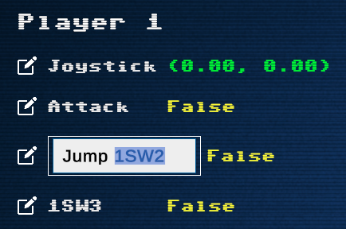

# Overview

The IDLE Press Utilities app provides Video Calibration and Input Testing tools that are useful for calibrating and debugging hardware on the arcade cabinet Ubuntu PC.

## Installation

1. Download the latest version of the [IDLE Press Utilities]() app
2. Extract the .zip and move the folder into the `/home/user` folder

### Launching The App

#### Mouse
The easy way to launch the app is to double-click the app icon using the mouse.
#### Keyboard
Since you may not always have a mouse available in the cabinet, here's how to launch the app using just a keyboard.

Open the Terminal using Ctrl + Alt + T

```bash
/home/user/idleutilities/idleutilities.x86_64
```

### In-App Keyboard Navigation

The IDLE Press Utilities UI is designed to work with keyboard navigation so that you don't also need to keep a mouse in the cabinet. 

{: .note }
Because the app is keyboard-first, using a mouse in the app may lead to unexpected results. For example if Input Testing is selected in the UI but you try to mouse-click on About, the Input Testing tool will open. *Just move the mouse pointer off screen and use the keyboard.*

Use the keyboard arrow keys to navigate menus, enter to select, escape key to exit the current screen. Alt + F4 will exit the app from any screen.

## Input Testing

The Input Testing tool allows you to check the operation of the primary 28 header inputs on the [IPAC-2](https://www.ultimarc.com/control-interfaces/i-pacs/i-pac2/) control interface.
* Joystick: right/left/up/down
* Switches: 1SW1 thru 1SW8, 2SW1 thru 2SW2, 1STRT, 2COIN, 2STRT, 2COIN

{: .note }
Switches 1A, 1B, 2A, 2B and not currently listed in the UI since they are MAME specific inputs (they can be added in an update if needed). Spinners and trackballs are also not currently supported.

Here are the default IPAC-2 keyboard input mappings which you can refer to when testing the Input Testing utility. Currently this screen only checks mappings for 1 input setup (P1), I will need to build another joystick/button rig and then extend the UI to support 2 player inputs.

#### IPAC-2 Default Key Mappings

This table shows the IPAC-2 default key mappings. The Input Testing tool has been setup with these mappings in mind so if you modify the defaults (see note below), the utilities app will need to be modified as well.

| Player 1 Input | Keyboard     | Player 2 Input | Keyboard |
| -------------- | ------------ | -------------- | -------- |
| 1RIGHT         | →            | 2RIGHT         | g        |
| 1LEFT          | ←            | 2LEFT          | d        |
| 1UP            | ↑            | 2UP            | r        |
| 1DOWN          | ↓            | 2DOWN          | f        |
| 1SW1           | left-control | 2SW1           | a        |
| 1SW2           | left-alt     | 2SW2           | s        |
| 1SW3           | spacebar     | 2SW3           | q        |
| 1SW4           | left-shift   | 2SW4           | w        |
| 1SW5           | z            | 2SW5           | i        |
| 1SW6           | x            | 2SW6           | k        |
| 1SW7           | c            | 2SW7           | 7        |
| 1SW8           | v            | 2SW8           | l        |
| 1STRT          | 1            | 2STRT          | 2        |
| 1COIN          | 5            | 2COIN          | 6        |
| 1A             | p            | 2A             | tab      |
| 1B             | enter        | 2B             | enter    |

{: .note }
I had issues with 1SW1 being mapped to left-control in my MacOS game testing as the OS wasn't allowing other inputs to be read while left-control is held. If the same issue occurs in the Ubuntu OS, then 1SW1 needs to be configured using the [WinIPAC Configuration Utility](https://www.ultimarc.com/winipacv2setup.exe). The IDLE Press Utilities app would also need to be updated to support the modified config. _This limitation may be something that can be addressed in a future release._

### Editing Switch Names

The default names in the Input Testing tool match the header names on the IPAC-2 (like 1SW1 etc) which could be confusing when testing inputs on the floor. Names can be edited to match the game's inputs.

{: .note }
Editing switch input names is an exception the note above about the app being "keyboard first". You have to use a mouse when editing the names.



To edit switch names:
1. Click the pencil icon next to each entry
2. Click into the input field and edit the name using the keyboard
3. Press enter or click-off to save the name, names are saved using PlayerPrefs so they are persistent between sessions.

Mouse click the "Reset Names" button in the upper right to restore default names. There is no warning, so be careful.

{: .note }
Once you start editing names the escape keyboard button won't work to exit, exit back to the main menu with mouse click.

You can also use HTML elements to style in the input names like:

```html
// color
<color=green>Jump</color>
<color=red>Attack!</color>

// italic
<i>Italic text</i>

// bold
<b>Bold text</b>

// combine elements
<color=#fb8500>orange text<i>orange italic text</i></color>

// other HTML elements probably work too, feel free to experiment!
```

### Future Updates

Add spinner and trackball support.
Add support for changing IPAC-2 key mappings

## Video Calibration

The Video Calibration tool is useful for adjusting various settings on the monitor. This feature would typically be used when initially setting up the cabinet.
